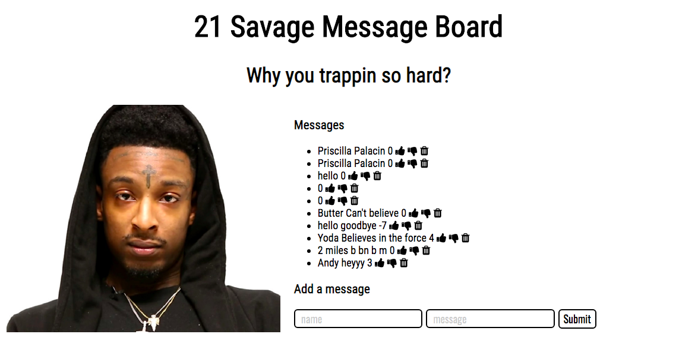

# 21 Savage Express App

### Goal: Create an app where users can post messages to 21 Savage fan board.

## Design and Development:
**Tech Used** HTML, CSS, JavaScript, Node, Express, EJS template, MongoDB:
Using Node, Express, JS, and MongoDB to store and access data, this app allows users to write messages to a fan board. Through the PUT method, users can thumbs up, thumbs down and delete messages from the database.

## Installation
1. Clone repo
2. run `npm install`

## Usage
1. run `node server.js`
2. Navigate to `localhost:<####>`
